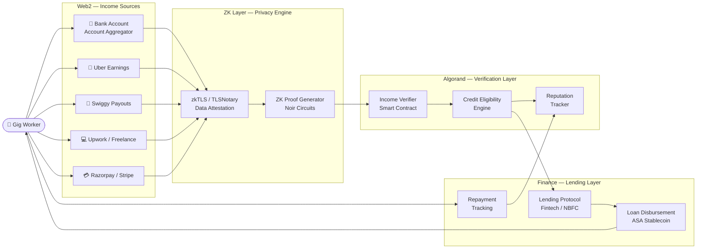
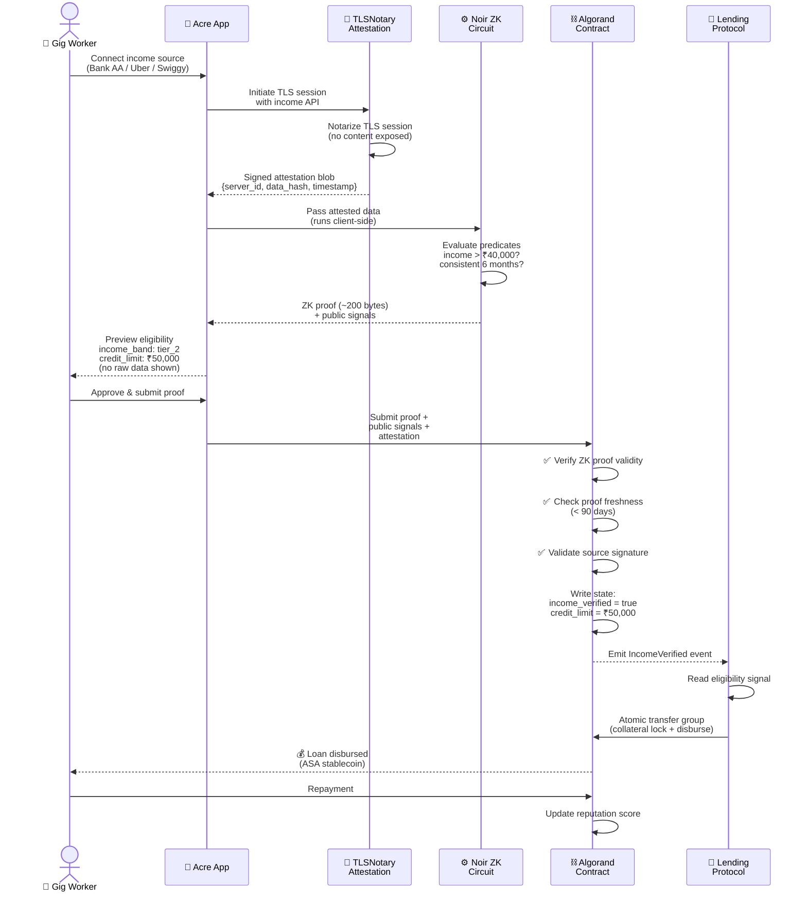
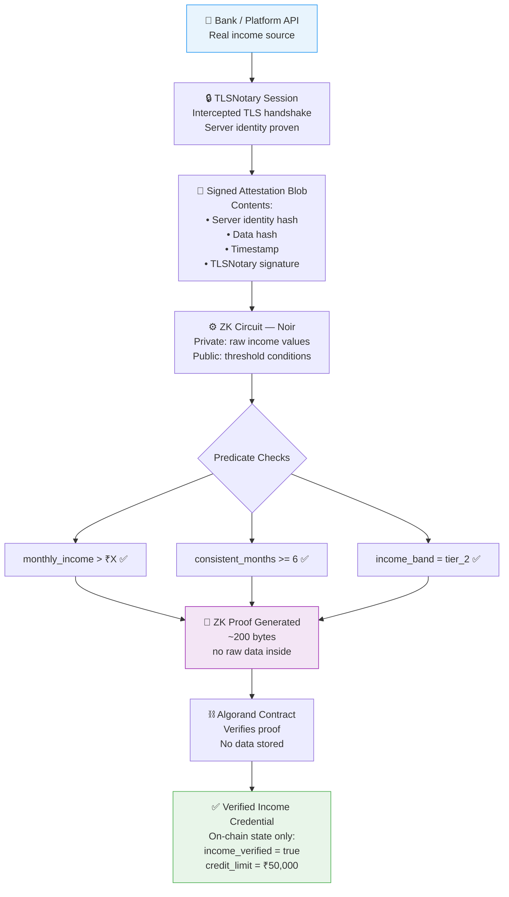
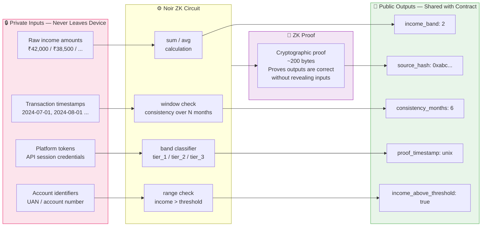
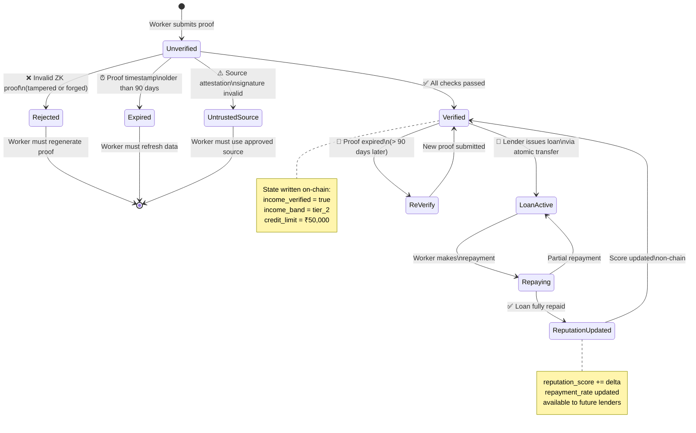
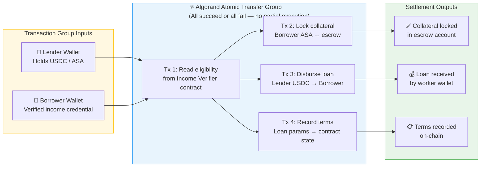
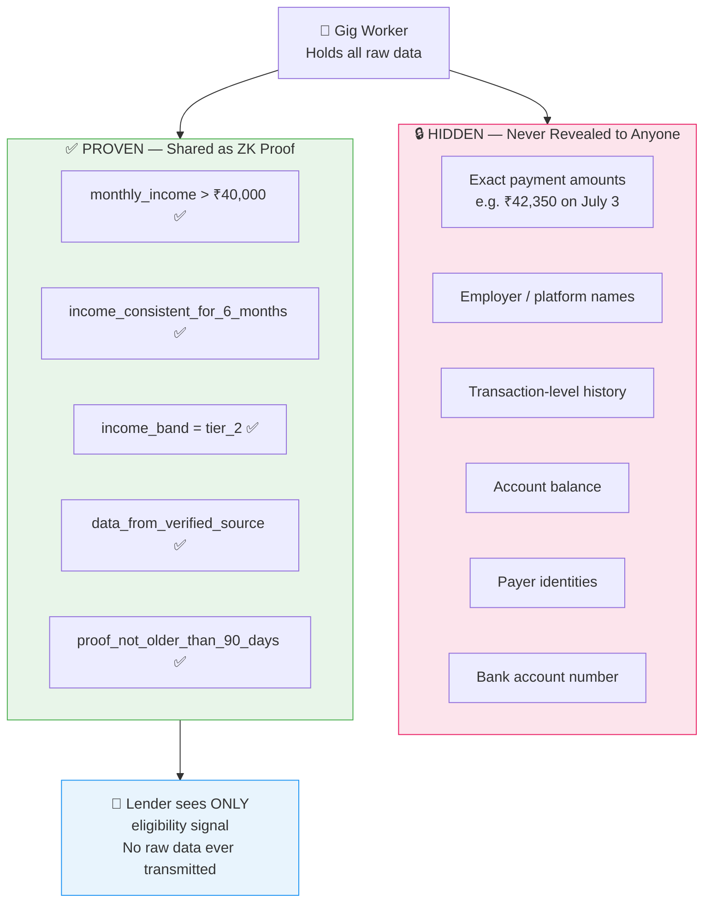
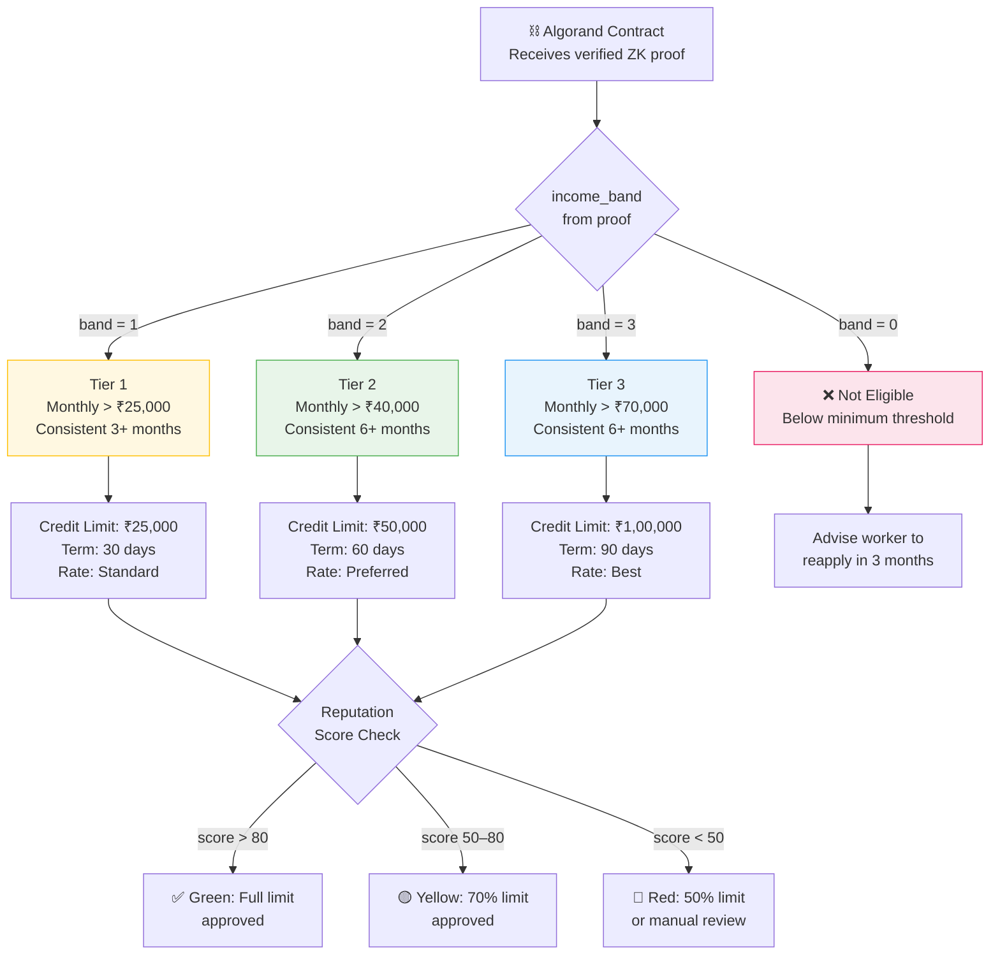
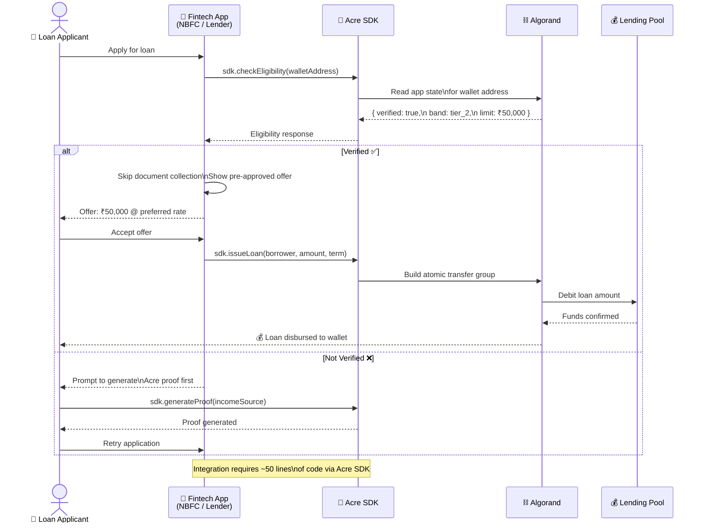
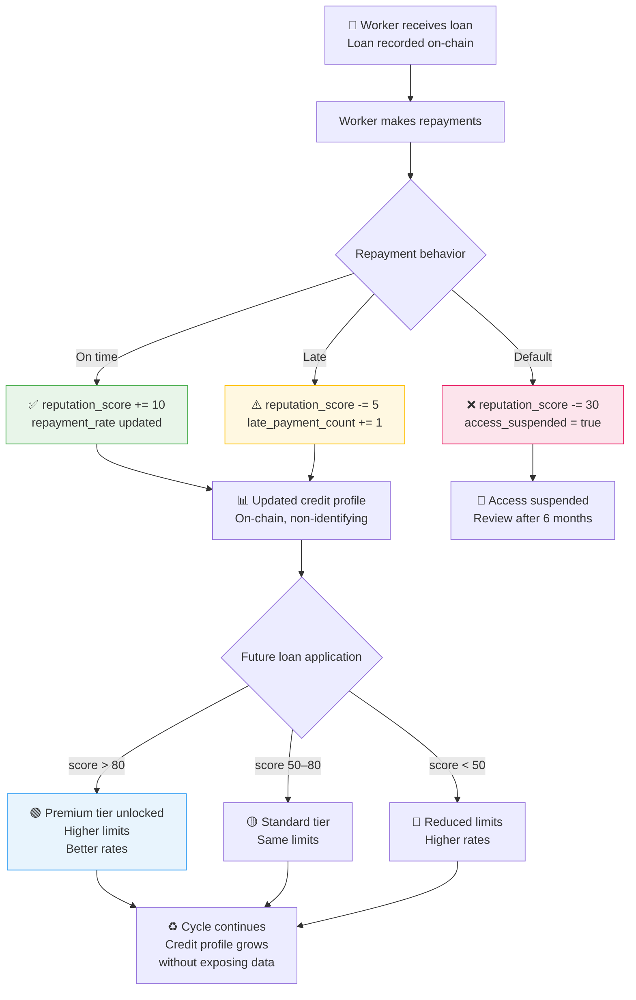

# Acre — Architecture & Flow Diagrams

> All system, user, and data flow diagrams for the Acre protocol.

---

## Table of Contents

1. [System Architecture](#1-system-architecture)
2. [User Flow — Worker Journey](#2-user-flow--worker-journey)
3. [Data Verification Flow](#3-data-verification-flow)
4. [ZK Proof Pipeline](#4-zk-proof-pipeline)
5. [Smart Contract State Machine](#5-smart-contract-state-machine)
6. [Lending Settlement Flow](#6-lending-settlement-flow)
7. [Privacy Model — What Is Hidden vs Proven](#7-privacy-model--what-is-hidden-vs-proven)
8. [Credit Tier Decision Flow](#8-credit-tier-decision-flow)
9. [Fintech SDK Integration Flow](#9-fintech-sdk-integration-flow)
10. [Reputation & Repayment Loop](#10-reputation--repayment-loop)

---

## 1. System Architecture

> The full end-to-end architecture showing how Web2 income data flows through the ZK layer into Algorand and then into a lending protocol.

---

## 2. User Flow — Worker Journey

> Step-by-step sequence of how a gig worker goes from connecting their income source to receiving a loan.

---

## 3. Data Verification Flow

> How raw Web2 financial data is transformed into a trustworthy, privacy-preserving attestation.

---

## 4. ZK Proof Pipeline

> The internal mechanics of the ZK proof — what stays private and what becomes public.

---

## 5. Smart Contract State Machine

> The lifecycle of a verification request inside the Algorand smart contract.

---

## 6. Lending Settlement Flow

> How Algorand's atomic transfers make loan disbursement secure and atomic.

---

## 7. Privacy Model — What Is Hidden vs Proven

> A clear map of what the ZK system reveals to lenders versus what stays with the worker.

---

## 8. Credit Tier Decision Flow

> How the ZK proof output maps to credit tiers inside the Algorand contract.

---

## 9. Fintech SDK Integration Flow

> How a fintech app or NBFC integrates Acre into their existing loan origination workflow.

---

## 10. Reputation & Repayment Loop

> How on-chain repayment history builds a decentralized credit profile over time.

---

## Summary

| Diagram | Purpose | Audience |
|---------|---------|----------|
| [System Architecture](#1-system-architecture) | Full stack overview |
| [User Flow](#2-user-flow--worker-journey) | Worker journey end-to-end |
| [Data Verification Flow](#3-data-verification-flow) | Trust model for Web2 data |
| [ZK Proof Pipeline](#4-zk-proof-pipeline) | Privacy guarantee mechanics |
| [Smart Contract State Machine](#5-smart-contract-state-machine) | Contract lifecycle |
| [Lending Settlement Flow](#6-lending-settlement-flow) | Atomic transfer design |
| [Privacy Model](#7-privacy-model--what-is-hidden-vs-proven) | What is/isn't revealed |
| [Credit Tier Decision](#8-credit-tier-decision-flow) | Credit scoring logic |
| [SDK Integration](#9-fintech-sdk-integration-flow) | Fintech partner integration |
| [Reputation Loop](#10-reputation--repayment-loop) | Long-term credit building | 

---

*Part of the Acre project — AlgoBharat Hack Series 3.0*
