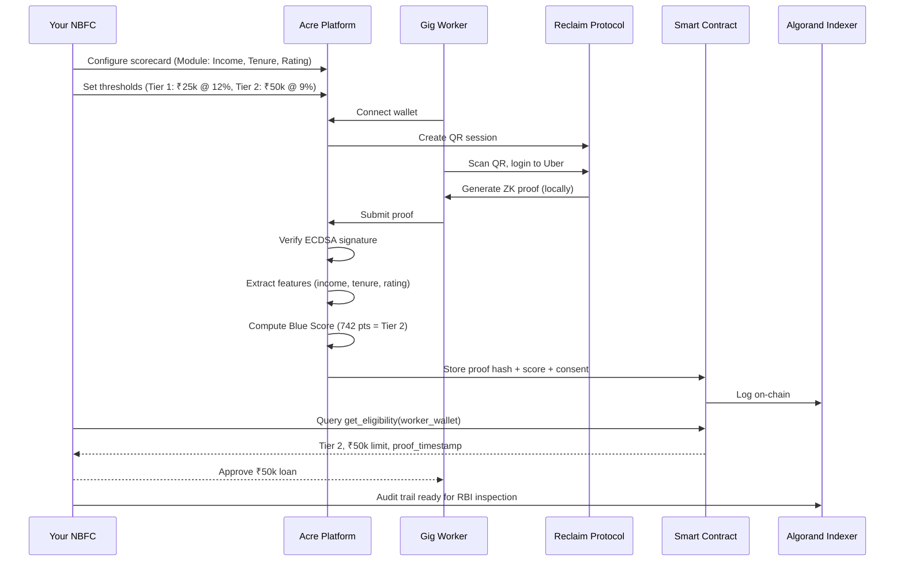
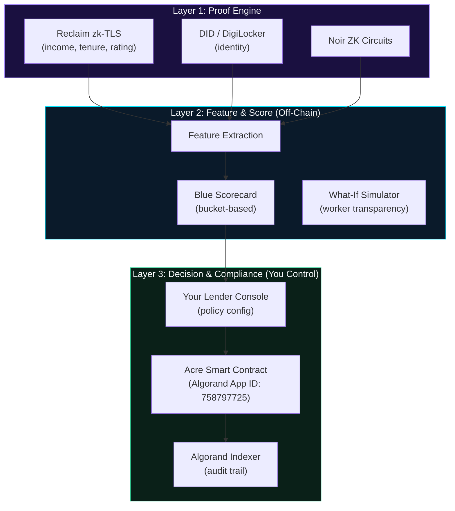

# Acre — Privacy-Preserving Underwriting Framework for Gig Workers

<p align="center">
  
</p>

<p align="center">
  <strong>Configurable. Regulatory-Safe. Zero DPDP Liability.</strong>
</p>

<p align="center">
  
  
  
  
</p>

<p align="center">
  <strong>Onboard India's 8M+ credit-invisible gig workers safely under RBI/DPDP norms.<br/>
  Configure your policy. Zero raw PII. Immutable audit trail.</strong>
</p>

<p align="center">
  <a href="#the-problem"><strong>Problem</strong></a>
  &nbsp;&middot;&nbsp;
  <a href="#the-solution"><strong>Solution</strong></a>
  &nbsp;&middot;&nbsp;
  <a href="#how-acre-works"><strong>How it works</strong></a>
  &nbsp;&middot;&nbsp;
  <a href="#getting-started"><strong>Get started</strong></a>
  &nbsp;&middot;&nbsp;
  <a href="#business-model"><strong>Business model</strong></a>
</p>

---

## Table of contents

<details open>
<summary><strong>Jump to a section</strong></summary>

**For Lenders**

- [The Problem](#the-problem)
- [The Solution](#the-solution)
- [How Acre Works](#how-acre-works)
- [What You Configure](#what-you-configure)

**Technical**

- [Architecture](#architecture)
- [Smart Contracts](#smart-contracts)
- [Tech Stack](#-tech-stack)

**Build**

- [Getting Started](#getting-started)
- [Developer Setup](#developer-setup)

**Context**

- [Why Algorand](#why-algorand)
- [Privacy & Compliance](#privacy--compliance)
- [Business Model & GTM](#business-model--gtm)

</details>

---

## The Problem

### RBI 2025 Blocked You. DPDP Threatens Your Balance Sheet.

**RBI Digital Lending Directions (2025)** banned SMS, contact lists, location tracking, and device fingerprinting for underwriting. **DPDP Act (2023)** threatens ₹250 crore penalties for raw PII misuse.

**Your situation:**
- You originated **301 lakh sub-₹50k accounts** in Q1 FY26 (NBFC-fintech data)
- You want to lend to **India's 8M+ gig workers** — the exact segment
- Your **old alternative-data playbook** is now **criminal and expensive**
- **Account Aggregator** only covers bank flows — misses platform tenure, ratings, completion rates that predict gig-worker repayment
- Result: **~40% approval rate on gig workers**, even good credit risks, because you're missing signals

### The Cost of Silence

| Challenge | Your Cost |
|-----------|-----------|
| **Manual thin-file underwriting** | ₹800–₹1,200 per applicant |
| **DPDP compliance team** | +3–5 people, ₹50–100L/year |
| **Market loss** | 8M gig workers you can't safely touch |
| **Regulatory audit prep** | ₹20–50L per inspection cycle |

---

## The Solution

### Acre is not a credit score. It is a **configurable, privacy-preserving underwriting framework** sold to lenders.

> **What you get:**
> 1. **You define the policy** — Select which proof modules (income, tenure, rating, identity) matter to YOUR risk appetite. Set thresholds. Adjust weights. No black box.
> 2. **Workers verify locally** — QR scan → Login to Uber/Swiggy → ZK proof generated on their phone → Only YOUR configured signals revealed. Zero custody of raw data.
> 3. **Blue Score computed** — Bucket-based, explainable scorecard (0–1000) → Prime/Plus/Basic tiers. You know exactly what drives each worker's score.
> 4. **Proof stored immutably** — Consent artifact + proof hash on Algorand. Immutable audit trail for RBI/DPDP inspections. Zero raw PII on your servers.
> 5. **You query in real-time** — `get_eligibility(worker_wallet)` → Instant credit tier, limit, proof timestamp. Your compliance team sleeps.

### What Changes for You

| Metric | Before | With Acre |
|--------|--------|-----------|
| **Cost per verification** | ₹950 (manual) | ₹55 (API) |
| **Approval rate on gig workers** | <40% | 70%+ (3x lift) |
| **Compliance cost** | +₹50–100L/year | –70% (audit trail built-in) |
| **Market accessible** | 0 gig workers safely | 8M+ gig workers |
| **Raw data custody** | You store it (DPDP risk) | Zero; only proof hash |

---

## How Acre Works

### Lender's Perspective: 4-Step Integration

```mermaid
flowchart LR
    subgraph CONFIG["1. Configure"]
        SELECT["Select proof modules<br/>(income, tenure, rating, identity)"]
        POLICY["Set risk thresholds<br/>(tier cutoffs, loan limits)"]
    end

    subgraph WORKER["2. Worker Verifies"]
        QR["QR scan to Uber/Swiggy"]
        PROOF["ZK proof generated locally<br/>(zero custody)"]
    end

    subgraph COMPUTE["3. Score & Store"]
        SCORE["Blue Score computed<br/>(explainable buckets)"]
        CHAIN["Proof hash + consent<br/>logged on Algorand"]
    end

    subgraph QUERY["4. Query & Disburse"]
        API["get_eligibility(wallet)<br/>→ tier, limit, timestamp"]
        DISBURSE["Approve or reject<br/>in real-time"]
    end

    CONFIG --> WORKER
    WORKER --> COMPUTE
    COMPUTE --> QUERY

    style CONFIG fill:#1a1040,stroke:#a78bfa,color:#f8fafc
    style WORKER fill:#0a1a2a,stroke:#00e5ff,color:#f8fafc
    style COMPUTE fill:#2a1a1a,stroke:#ec4899,color:#f8fafc
    style QUERY fill:#0a2018,stroke:#34d399,color:#f8fafc
```



### Step-by-Step: Worker to Lender



---

## What You Configure

### The Lender Console

No coding. Visual configuration. See impact before deployment.

```
┌─ SELECT PROOF MODULES ──────────┐
│ ✓ Income (₹20k–₹40k–₹60k)      │
│ ✓ Tenure (3mo–6mo–12mo)        │
│ ✓ Rating (4.0–4.5–4.8)         │
│ ✓ Completion Rate              │
│ ✗ Crypto Holdings              │
└────────────────────────────────┘

┌─ SET POINT BUCKETS ─────────────┐
│ Income ₹40k+ ........... 200 pts │
│ Tenure 6+ mo ........... 180 pts │
│ Rating 4.5+ ............ 160 pts │
│ Activity High .......... 150 pts │
│ ─────────────────────────────── │
│ TOTAL: 800+ pts = Your Tier 1   │
└────────────────────────────────┘

┌─ SET LOAN PRODUCTS ─────────────┐
│ Tier 1 (800+): ₹50k @ 9% APR   │
│ Tier 2 (650-800): ₹25k @ 12%   │
│ Tier 3 (<650): ₹10k @ 15%      │
└────────────────────────────────┘
```

### Pre-Deployment Impact Preview

See how your thresholds affect approval rates **before going live:**

```
Your current policy:
└─ 1,000 gig-worker applicants
   ├─ 300 qualify Tier 1 (30% → ₹50k)
   ├─ 450 qualify Tier 2 (45% → ₹25k)
   └─ 250 qualify Tier 3 (25% → ₹10k)
   
   Portfolio impact: ₹18.75 Cr potential disbursement
   Expected default rate (based on 6mo data): <4%
```

---

## Architecture

### 3-Layer System (You Own Layer 3)



| Layer | What It Does | Who Controls It |
|-------|--------------|-----------------|
| **Proof Engine** | Generates ZK proofs locally (zero custody) | Reclaim + Algo community |
| **Feature & Score** | Computes features and Blue Score | Acre platform |
| **Decision & Compliance** | Your policy, your audit trail | **YOU (Lender)** |

**Critical:** You never see raw data. You only see: proof hash + score + eligibility outcome.

---

## Smart Contracts

**App ID (TestNet):** `758797725`

### What the Contract Does

```python
@application.internal()
def verify_income(
    proof_hash: str,
    score: uint64,
    tier: str,
    credit_limit: uint64,
) -> None:
    """
    Store worker's verified score and credit tier.
    Called by Acre backend after proof verification.
    Only designated verifier can write.
    """
    worker_state = local_state(acct := TxnFields.sender())
    worker_state['proof_hash'] = proof_hash
    worker_state['score'] = score
    worker_state['tier'] = tier
    worker_state['credit_limit'] = credit_limit
    worker_state['timestamp'] = Global.latest_timestamp()

@application.external(read_only=True)
def get_eligibility(address: str) -> TupleType(str, uint64, uint64):
    """
    Query worker's tier, score, and credit limit.
    Permissionless — any lender can call.
    """
    worker_state = local_state(address)
    return (
        worker_state['tier'],
        worker_state['score'],
        worker_state['credit_limit']
    )
```

### How You Use It

```bash
# 1. After Acre backend verifies a worker's proof
algosdk.send_atomic(group=[
    txn.verify_income(
        proof_hash="0x1a2b3c...",
        score=742,
        tier="Tier 2",
        credit_limit=2500000  # ₹25k in microAlgos
    )
])

# 2. When an applicant submits a loan request
eligibility = contract.get_eligibility(worker_wallet)
tier, score, limit = eligibility

if score >= 650:
    print(f"Approve ₹{limit/100000} loan at your {tier} rate")
else:
    print("Decline or offer Tier 3 micro-loan")
```

---

## 🛠️ Tech Stack

| Area | Technologies |
|------|--------------|
| **Framework** | Configurable, privacy-preserving underwriting |
| **Proof Engine** | Reclaim Protocol (zk-TLS), Noir ZK Circuits, DID-ready |
| **Frontend** | React 18, TypeScript, Vite, Tailwind CSS |
| **Backend** | Node.js 20+, Express, Algorand SDK |
| **Smart Contracts** | PyTeal, ARC-4 ABI |
| **Database** | Supabase (workflows, audit logs) |
| **Blockchain** | Algorand (sub-3s finality, ~₹0.02 per verification) |

---

## Why Algorand

| Property | Why It Matters to You |
|:---|:---|
| ⚡ **Sub-3s Finality** | Real-time loan decisions during customer session |
| 💰 **~0.001 ALGO/tx** | Verification costs ~₹0.02; doesn't eat margins on ₹5k loans |
| 🏛️ **Deterministic Execution** | Credit rules execute identically every time—RBI compliance critical |
| 🗂️ **ARC-4 + Indexer** | Clean SDK for your team; immutable audit trail for regulators |
| 🌱 **Carbon Negative** | ESG alignment for impact-focused investors and regulators |

---

## Screenshots

See the full visual walkthrough of Acre's lender and worker flows: **[SCREENS.md](./SCREENS.md)**

**Quick preview:**
- **Lender Console:** Configure your scorecard, set thresholds, see portfolio impact
- **Worker Proof Flow:** Identity → QR scan → ZK proof → Blue Score → Dashboard
- **What-If Simulator:** See how actions unlock better credit tiers
- **Lender Dashboard:** Monitor workers, track approvals, manage risk
---

## Getting Started

### For Lenders (2-Hour Onboarding)

| Step | Time | Action |
|------|------|--------|
| **1. Demo** | 30 min | See Acre in action + ask compliance questions |
| **2. Configure** | 45 min | Build your scorecard in Lender Console (no code) |
| **3. Test** | 30 min | Run 10 test workers through end-to-end |
| **4. Deploy** | 15 min | Flip switch to production (TestNet → MainNet) |

**Result:** Live gig-worker underwriting in 2 hours. Your audit trail baked in.

### For Workers (60 Seconds)

1. Visit [acre-web-three.vercel.app](https://acre-web-three.vercel.app)
2. Connect Pera or Defly wallet
3. Scan Reclaim QR → Login to Uber/Swiggy
4. See your Blue Score + credit tier
5. Share proof with lenders (your choice)

Fund TestNet wallet: [Algorand dispenser](https://dispenser.testnet.aws.algodev.network/)

---

## Developer Setup

### Prerequisites

- Node.js 18+
- npm 9+
- Docker (optional, for LocalNet)

### Clone and install

```bash
git clone https://github.com/somehowliving/acre.git
cd acre

cd projects/acre-web && npm install
cd ../acre && npm install
cd ../acre-contract && npm install
```

### Environment configuration

**Frontend** (`projects/acre-web`):

```bash
cp .env.example .env.local
```

| Variable | Required | Purpose |
|----------|:--------:|---------|
| `VITE_RECLAIM_APP_ID` | Yes | Reclaim protocol |
| `VITE_RECLAIM_APP_SECRET` | Yes | Reclaim secret |
| `VITE_BACKEND_VERIFY_URL` | Yes | Backend endpoint |
| `VITE_ALGORAND_APP_ID` | Yes | `758797725` (TestNet) |
| `VITE_ALGOD_SERVER` | Yes | Algorand RPC |

**Backend** (`projects/acre`):

```bash
cp .env.example .env
```

| Variable | Required | Purpose |
|----------|:--------:|---------|
| `APP_ID` | Yes | Acre contract app ID |
| `ALGOD_SERVER` | Yes | Algorand RPC |
| `VERIFIER_MNEMONIC` | Yes | Proof signer account |

### Run locally

**Terminal 1 - Backend**

```bash
cd projects/acre
npm start
# Listening on http://localhost:3001
```

**Terminal 2 - Frontend**

```bash
cd projects/acre-web
npm run dev
# Listening on http://localhost:5173
```

---

## Privacy & Compliance

### DPDP Act 2023 Alignment

**Every feature is designed to minimize your DPDP liability.**

| Principle | Your Protection |
|-----------|-----------------|
| **Data Minimization** | Zero raw financial data on your servers; only proof hash + score |
| **Purpose Limitation** | Credit eligibility only; no cross-selling, no aggregation |
| **Storage Limitation** | Acre stores nothing; you store only tier/score/limit/timestamp |
| **Consent-Based** | Worker explicitly approves every proof; logged on-chain |
| **Verifiability** | Algorand Indexer provides immutable audit trail for inspections |
| **Right to Erasure** | On-chain state nullifiable; zero off-chain raw data |

### Your Audit Trail

✓ Algorand Indexer logs every proof verification (consent + score, no PII)  
✓ Suitable for RBI Digital Lending inspection  
✓ Suitable for DPDP Act compliance audit  
✓ Export for your compliance team in 2 clicks  

---

## Business Model & GTM

Detailed pricing, unit economics, roadmap, and partnership strategy: **[GTM.md](../docs/GTM.md)**

---

## References

- [RBI Digital Lending Directions (2025)](https://www.rbi.org.in)
- [DPDP Act, 2023](https://www.meity.gov.in)
- [NITI Aayog — India's Gig Economy Report](https://niti.gov.in)
- [Algorand Documentation](https://developer.algorand.org)
- [Reclaim Protocol](https://reclaimprotocol.org)

---

## Team

**zkFarmers** — Building regulatory-safe credit infrastructure for emerging markets

| Member | Role | GitHub |
|:---|:---|:---|
| Nidhi Prajapati | Blockchain & ZK Engineer | [@somehowliving](https://github.com/somehowliving) |

---

<p align="center">
  <strong>8M+ gig workers. 0 custody. ₹250Cr DPDP penalty avoided.<br/>
  Acre is the underwriting framework regulators want.</strong>
</p>

<p align="center">
  Built for India's future of finance
</p>