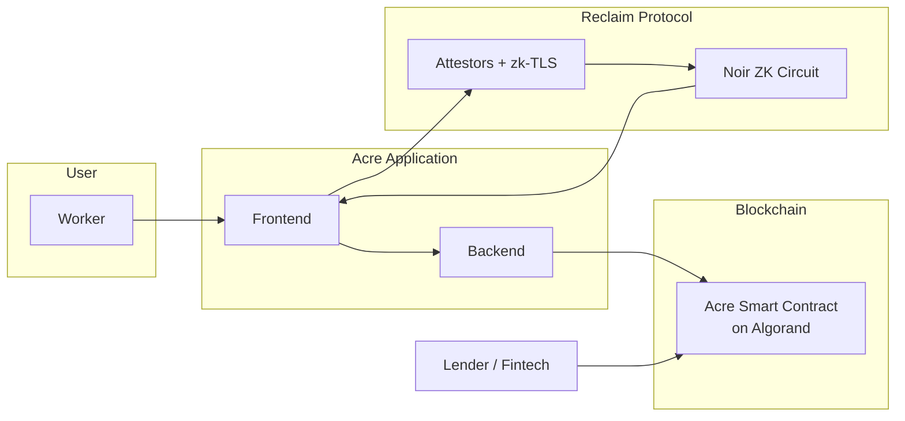
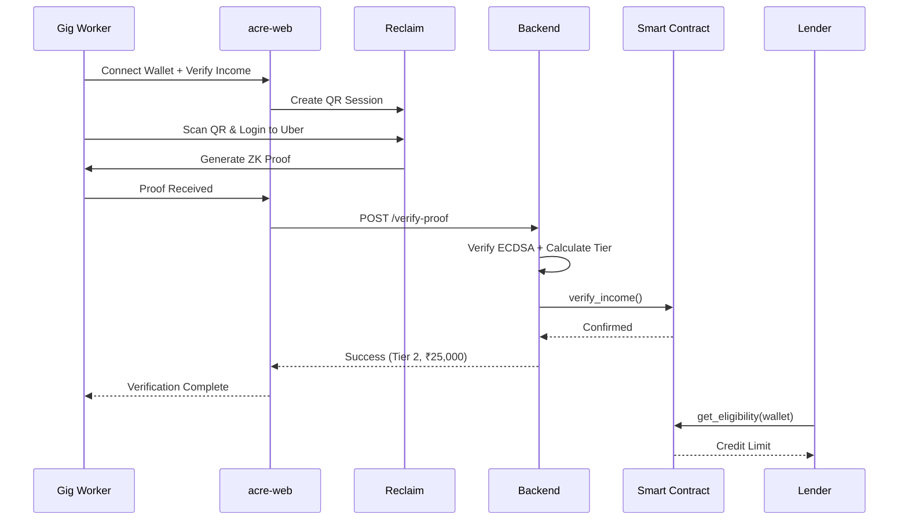
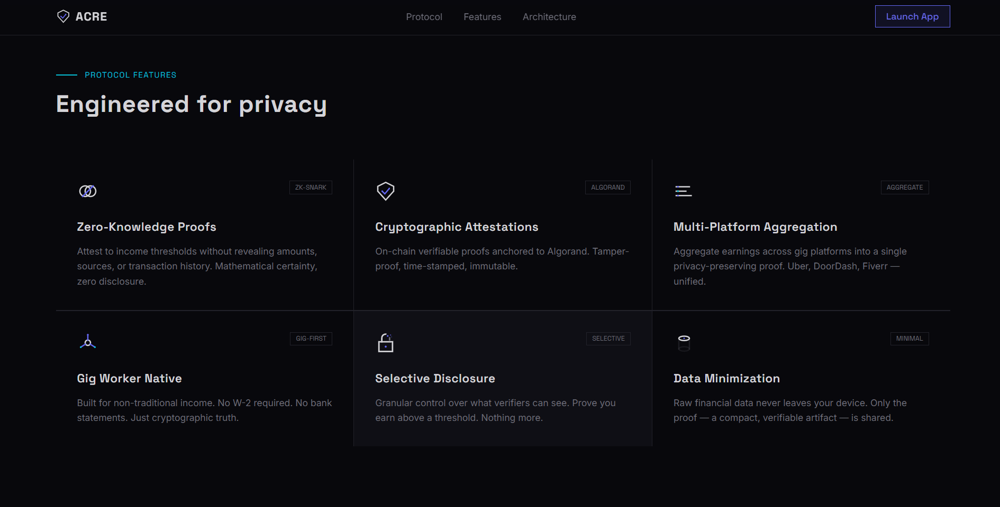
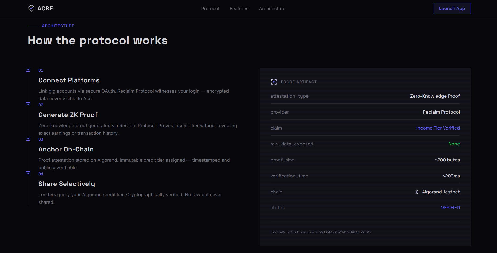
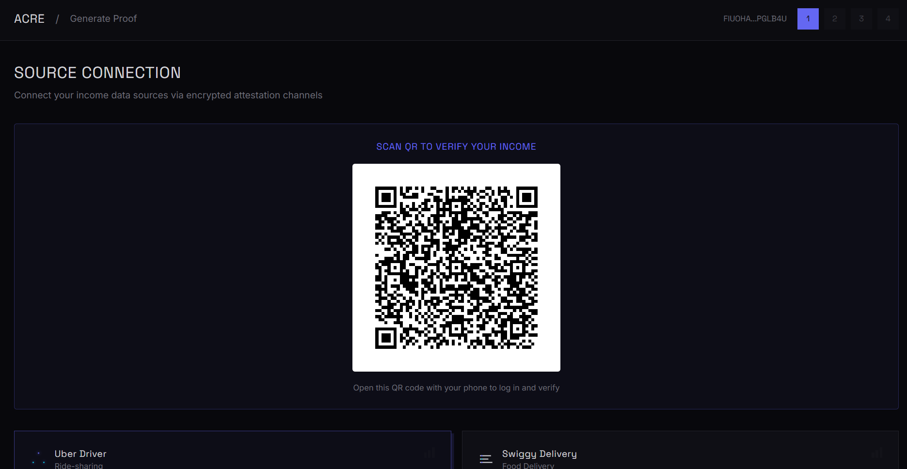
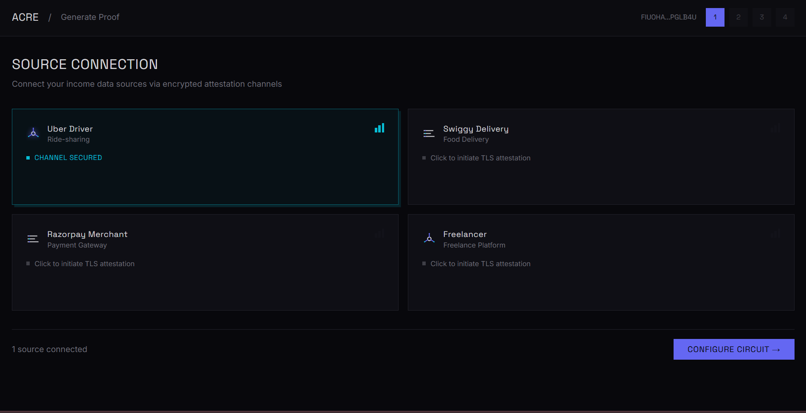
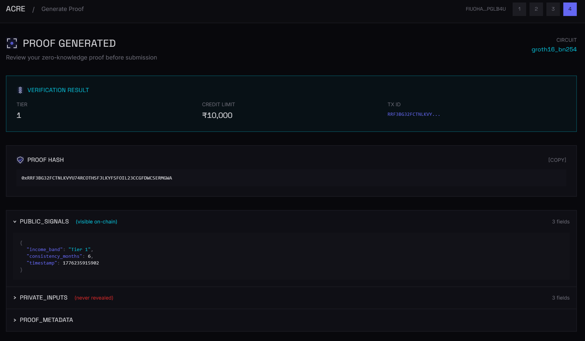

<h2 align="center">
  Acre — Privacy-Preserving Income Verification for Gig Workers
</h2>

<p align="center">
  
</p>

<p align="center">
  
  
  
  
  
  
  
</p>

---

*LIVE*: 
[https://acre-web-three.vercel.app](https://acre-web-three.vercel.app)

*DEMO*:
[https://youtu.be/Ih3T59cOI_I](https://youtu.be/Ih3T59cOI_I)

*APP_ID*: `758797725` (Algorand Testnet)

---

## Table of Contents

1. [Problem Statement](#problem-statement)
2. [Solution Overview](#how-acre-solves-it)
3. [High-Level Architecture](#3-high-level-architecture)
4. [System Components](#4-system-components)
5. [User Journey](#5-user-journey-architecture)
6. [Screenshots](#6-screenshots)
7. [Why Algorand](#why-algorand)
8. [Privacy & Compliance](#privacy--compliance-dpdp-act)
9. [Smart Contract Logic](#9-smart-contract-logic)
10. [Project Structure](#10-project-structure)
11. [Tech Stack](#-tech-stack)
12. [Live Demo & Deployment](#-live-demo--deployment)
13. [Installation & Setup](#️-installation--local-setup)
14. [Use Cases](#-real-world-use-cases)
15. [Roadmap](#️-roadmap)
16. [References](#15-references)
17. [Team](#-team)
18. [Track Alignment](#-track-alignment)

---

<h2 align="center">The Problem We're Solving</h2>

<p align="center">
  
  
</p>

<br/>

<p align="center">
  India's <b>1.2 crore gig workers</b> — Uber drivers, Swiggy delivery partners, Upwork freelancers — earn consistently.<br/>
  Yet they remain <b>credit-invisible</b> to formal lenders and face a false choice:<br/>
  <b>Financial Access OR Data Privacy</b>
</p>

<br/>

### The Core Challenge

| Challenge | Impact |
|:---|:---|
| Raw bank statements shared with lenders | Privacy violations & DPDP breaches |
| Platform earnings exposed openly | Aggregation & misuse risks |
| Centralized data storage | Single point of failure |
| No formal employment records | Instant rejection by traditional lenders |

### The Scale
- **~1.2 crore** gig workers in India (growing ecosystem)
- **~40%** of informal earners credit-constrained (World Bank)
- **10.9 crore** loans by fintechs (FY24-25) — yet gig workers excluded

---

<h2 align="center">How Acre Solves It</h2>

<p align="center">
  
</p>

Acre is a **privacy-preserving income verification protocol** that allows gig workers to cryptographically prove their earning capacity — without exposing any raw financial data.

### What Workers Prove (Without Revealing)

<p align="center">

| Provable | Hidden |
|:---:|:---:|
| ✓ monthly_income > ₹40,000 | ❌ Exact amounts |
| ✓ income_consistent_for_6_months | ❌ Transactions |
| ✓ income_band = tier_2 | ❌ Platform names |
| ✓ Credit eligible | ❌ Account balance |

</p>

### How It Works (In One Line)

<p align="center">
  <code>Worker connects income → ZK proof generated locally → proof submitted to Algorand → verified eligibility → loans issued</code>
</p>

---

## 3. High-Level Architecture



---

## 4. System Components

| Component | Tech Stack | Responsibility |
|:---|:---|:---|
| **Frontend** | React 18 + TypeScript + Vite + Tailwind | UI, Wallet (Pera), Reclaim SDK, Opt-in |
| **Backend** | Node.js + Express | Proof verification, tier calculation, chain submission |
| **Reclaim Protocol** | zk-TLS + Attestor Network | Secure data attestation & ZK proof generation |
| **Smart Contract** | PyTeal (ARC-4) | Immutable eligibility storage & queries |
| **Blockchain** | Algorand Testnet | Finality, low fees, atomicity |

---

## 5. User Journey Architecture



---

## 6. Screenshots

### 1. Product Feature Overview


### 2. Protocol Flow / How Acre Works


### 3. User Dashboard


### 4. Proof Generation Workspace


### 5. Reclaim QR Scan Step


### 6. Data Source Connected (Uber)


### 7. Verification In Progress


### 8. Proof Successfully Generated


### 9. Lender Verification Dashboard


---

<h2 align="center">Why Algorand</h2>

<p align="center">
  
</p>

<p align="center">

| Property | Why It Matters for Acre |
|:---:|:---|
| ⚡ **Sub-3s Finality** | Workers get loan confirmation near-instantly |
| 💰 **~0.001 ALGO/tx** | Microloan issuance economically viable at any size |
| 🔗 **Atomic Transfers** | Collateral + disbursement in single transaction |
| 🎯 **ASA Support** | Native stablecoin support (USDC, INR-pegged) |
| 🏛️ **Deterministic Execution** | Credit rules behave identically every time |
| 🗂️ **ARC-4 ABI** | Clean SDK integration for fintech partners |
| 📊 **Indexer** | Audit trails for RBI / regulatory reporting |

</p>

---

<h2 align="center">Privacy & Compliance (DPDP Act)</h2>

<p align="center">
  <b>Built from the ground up to align with India's Digital Personal Data Protection Act, 2023</b>
</p>

<p align="center">

| DPDP Principle | Acre Implementation |
|:---|:---|
| **Data Minimization** | Only income predicates revealed — never raw transactions |
| **Purpose Limitation** | Data used exclusively for credit eligibility |
| **Storage Limitation** | Zero raw financial data stored anywhere |
| **Consent-based** | Worker explicitly approves proof generation |
| **Verifiability** | Cryptographic proofs provide audit trails |
| **Right to Erasure** | On-chain state nullifiable; off-chain data never stored |

</p>

### Regulatory Audit Trail
- ✓ Algorand Indexer provides immutable event logs
- ✓ Logs contain only proof hashes & eligibility outcomes (no PII)
- ✓ Suitable for RBI / fintech regulator reporting

---

## 9. Smart Contract Logic

**App ID (Testnet):** `758797725`

**Key Features:**
- Local state per user (~70 bytes)
- Only designated verifier can write
- Permissionless read methods (`get_eligibility`, `get_full_profile`, etc.)
- Replay protection via proof hash
- Timestamp freshness checks

See [`CONTRACT.md`](docs/CONTRACT.md) for full specification.

---

## 10. Project Structure

This is a **multi-repo** project:

- **`acre-web`** → Frontend (React + Vite) → [Link](https://github.com/somehowliving/acre-web)
- **`acre`** → Node.js Express server
- **`acre-contract`** → PyTeal smart contract → [Link](https://github.com/SomehowLiving/Acre/blob/main/contracts/acre_verification.py)

---

<h2 align="center">🛠️ Tech Stack</h2>

<p align="center">
  
  
  
  
  
  
  
  
</p>

| Layer | Technology |
|:---|:---|
| **Blockchain** | Algorand AVM, PyTeal Smart Contracts |
| **Privacy** | Reclaim Protocol (zk-TLS), Noir ZK Circuits |
| **Frontend** | React 18 + TypeScript + Vite + Tailwind CSS |
| **Backend** | Node.js + Express + Algorand SDK |
| **Proof Verification** | ECDSA signature validation |
| **Compliance** | DPDP Act 2023 aligned |

---

## 11. Live Demo & Deployment

- **Frontend:** [https://acre-web-three.vercel.app](https://acre-web-three.vercel.app/)
- **Network:** Algorand Testnet
- **Smart Contract:** App ID `758797725`

### Environment Variables

| Variable | Required | Description |
|:---|:---:|:---|
| `VITE_RECLAIM_APP_ID` | Yes | Reclaim app ID |
| `VITE_RECLAIM_APP_SECRET` | Yes | Reclaim secret |
| `VITE_RECLAIM_PROVIDER_ID` | Yes | Reclaim provider ID |
| `VITE_BACKEND_VERIFY_URL` | Yes | Backend verify endpoint |
| `VITE_ALGORAND_APP_ID` | Yes | Target Algorand app ID |
| `VITE_ALGOD_SERVER` | Yes | Algod RPC URL |
| `VITE_ALGOD_TOKEN` | No | Algod token (if required) |

---

<h2 align="center">⚙️ Installation & Local Setup</h2>

<p align="center">
  <b>Get Acre running locally in 5 minutes</b>
</p>

### Prerequisites
- Node.js v18+
- Pera or Defly Wallet
- Testnet ALGO in two accounts (Verifier + Testing)

### 1. Clone Repositories

```bash
git clone https://github.com/somehowliving/acre-web.git
git clone https://github.com/somehowliving/acre.git
```

### 2. Frontend (`acre-web`)

```bash
cd acre-web
npm install
cp .env.example .env
```

**Configure `.env`:**
```env
VITE_RECLAIM_APP_ID=your_app_id
VITE_RECLAIM_APP_SECRET=your_secret
VITE_RECLAIM_PROVIDER_ID=uber_provider_id
VITE_BACKEND_VERIFY_URL=http://localhost:3001/verify-proof
VITE_ALGORAND_APP_ID=758797725
VITE_ALGOD_SERVER=https://testnet-api.algonode.cloud
```

**Run:**
```bash
npm run dev
```

### 3. Backend (`acre-backend`)

```bash
cd ../acre
npm install
cp .env.example .env
```

**Configure `.env`:**
```env
APP_ID=758797725
ALGOD_SERVER=https://testnet-api.algonode.cloud
VERIFIER_MNEMONIC=your_25_word_mnemonic_here
ADMIN_MNEMONIC=your_admin_mnemonic_here
```

**Run:**
```bash
npm start
```

### Quick Start Summary

1. Start **Backend** (`npm start`)
2. Start **Frontend** (`npm run dev`)
3. Open `http://localhost:8080`
4. Connect wallet → Verify Income → Scan QR with phone

**Live Demo:** [acre-web-three.vercel.app](https://acre-web-three.vercel.app/)

---

<h2 align="center">💡 Real-World Use Cases</h2>

<p align="center">

### 🛵 Gig Worker Microloans
Swiggy delivery partner with 8 months of ₹35,000/month → ZK proof → ₹25,000 working capital loan (no bank statement required)

### 💼 Freelancer Credit Lines
Upwork freelancer proves income consistency → access rolling credit line for equipment purchases

### 🛒 Privacy-Preserving BNPL
Fintech integrates Acre SDK → offer BNPL at checkout → eligibility verified in seconds

### 🏦 Decentralized Lending Pools
DeFi protocols on Algorand use verified income signal as undercollateralized loan indicator

</p>

---

<h2 align="center">🗺️ Roadmap</h2>

<p align="center">

| Phase | Timeline | Milestone |
|:---:|:---|:---|
| **Phase 1** | Current | Bank AA connector, Noir circuit, Algorand contract |
| **Phase 2** | Month 1–2 | Uber, Swiggy, Razorpay connectors; SDK alpha |
| **Phase 3** | Month 3–4 | NBFC/fintech pilot; 100 test users |
| **Phase 4** | Month 5–6 | DeFi lending pool; reputation scoring; RBI sandbox |
| **Phase 5** | Month 7–12 | Multi-chain support; insurance; credit bureau integration |

</p>

---

## 15. References

1. NITI Aayog — *India's Booming Gig and Platform Economy* (2022)
2. World Bank — *SME Finance Overview: Credit Constraints in Emerging Markets*
3. MSME Annual Report 2024–25 — Ministry of MSME, Government of India
4. SIDBI — *MSME Sector Report 2024–25*
5. RBI — *Account Aggregator Framework Documentation*
6. Digital Personal Data Protection Act, 2023 — Ministry of Electronics and IT
7. TLSNotary — *Privacy-Preserving Data Provenance from Web2 Sources*, tlsnotary.org
8. Noir Language Documentation — noir-lang.org
9. Algorand Developer Documentation — developer.algorand.org
10. LiveMint / Economic Survey coverage — Gig worker credit access (2025–26)

---

<h2 align="center">👥 Team</h2>

<p align="center">
  <b>zkFarmers — Building Privacy for Millions</b>
</p>

<p align="center">

| Member | Role |
|:---:|:---|
| Nidhi Prajapati [https://github.com/somehowliving]| Blockchain & ZK Engineer |

</p>

---

<h2 align="center">🎯 Track Alignment</h2>

<p align="center">

| Track | How Acre Fits |
|:---:|:---|
| **Future of Finance** | Privacy-preserving lending infrastructure for India's gig economy |
| **DPDP & RegTech** | Built-in DPDP Act compliance via data minimization & ZK proofs |

</p>

---

<p align="center">
  <b>✨ Acre doesn't ask gig workers to choose between privacy and financial access.<br/>It proves they never had to. ✨</b>
</p>

<p align="center">
  
</p>

<p align="center">
  Built with ♥ for India's 1.2 crore gig workers
</p>