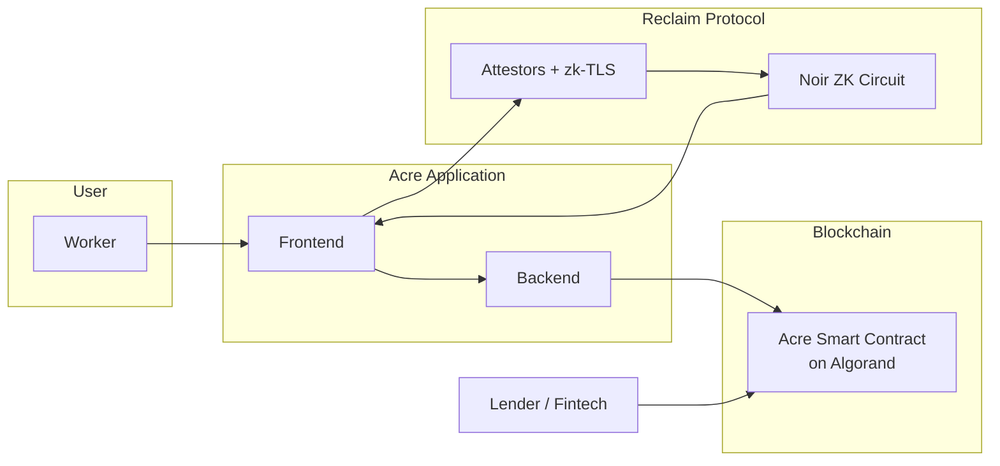
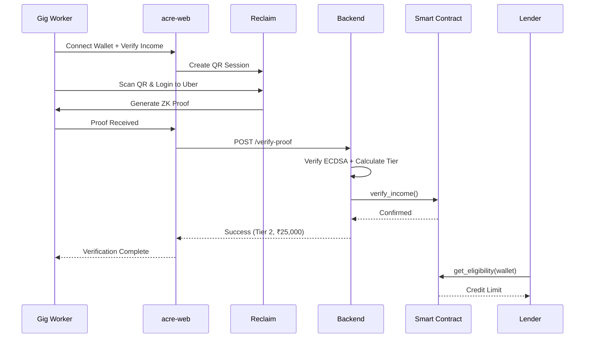

# Acre — Privacy-Preserving Income Verification for Gig Workers

> **A zero-knowledge verification protocol that enables gig workers to prove income eligibility for loans — without revealing financial history.**

[](https://algorand.com)
[](https://noir-lang.org)
[](https://algobharat.in)
[](https://algobharat.in)

---

## Table of Contents

1. [Problem Statement](#1-problem-statement)
2. [Solution Overview](#2-solution-overview)
3. [High-Level Architecture](#3-high-level-architecture)
4. [System Architecture](#4-system-architecture)
5. [User Journey Architecture](#5-user-journey-architecture)
6. [Core Components](#6-core-components)
7. [Why Algorand](#7-why-algorand)
8. [Privacy & Compliance (DPDP Act)](#8-privacy--compliance-dpdp-act)
9. [Smart Contract Logic](#9-smart-contract-logic)
10. [Project Structure](#10-project-structure)
11. [Live Demo & Deployment](#11-live-demo--deployment)
12. [Setup & Installation](#12-setup--installation)
13. [Use Cases](#13-use-cases)
14. [Roadmap](#14-roadmap)
15. [References](#15-references)
16. [Team](#16-team)

---

## 1. Problem Statement

India's **1.2 crore gig workers** — Uber drivers, Swiggy delivery partners, Upwork freelancers — generate regular, verifiable platform income. Yet they remain **credit-invisible** to formal lenders.

### Why lenders reject them

Traditional lenders require:
- Salary slips from a permanent employer
- Formal payroll records
- Historical bank statements with stable inflows

Gig workers have **none of these in standard form**, despite earning consistently.

### Why sharing data isn't the answer

| Data Exposure Risk | Consequence |
|:---|:---|
| Raw bank statements shared with lenders | Privacy violation for workers |
| Platform earnings shared openly | Breach of DPDP Act principles |
| Transaction histories uploaded to fintech apps | Data aggregation and misuse risk |
| Centralized storage of income data | Single point of failure / breach |

### The scale of the problem

- **~1.2 crore** gig/platform workers in India (FY25, growing)
- **~40%** of small/informal earners are credit-constrained (World Bank)
- **10.9 crore** loans disbursed by fintechs in FY24-25 — yet most gig workers still excluded
- Fintechs have distribution, but lack **privacy-safe underwriting signals** for this segment

### The core tension

> Gig workers face a false choice: **financial access OR data privacy.** Acre eliminates that tradeoff.

---

## 2. Solution Overview

Acre is a **privacy-preserving income verification protocol** that allows gig workers to cryptographically prove their earning capacity — without exposing any raw financial data.

### What workers prove (without revealing)

```
monthly_income > ₹40,000          ✓ provable, source hidden
income_consistent_for_6_months    ✓ provable, transactions hidden
income_band = tier_2              ✓ provable, exact amount hidden
```

### What remains private

```
❌ Exact payment amounts
❌ Employer / platform names
❌ Transaction-level history
❌ Account balance
❌ Payer identities
```

### How it works in one line

Workers connect their income source → a ZK proof is generated locally → the proof (not the data) is submitted to an Algorand smart contract → lenders get a verified eligibility signal → loans are issued.

---

## 3. High-Level Architecture



---

## 4. System Components

| Component | Tech Stack | Responsibility |
|:---|:---|:---|
| **Frontend** | React 18 + TypeScript + Vite + Tailwind | UI, Wallet (Pera), Reclaim SDK, Opt-in |
| **Backend** | Node.js + Express | Proof verification, tier calculation, chain submission |
| **Reclaim Protocol** | zk-TLS + Attestor Network | Secure data attestation & ZK proof generation |
| **Smart Contract** | PyTeal (ARC-4) | Immutable eligibility storage & queries |
| **Blockchain** | Algorand Testnet | Finality, low fees, atomicity |

---

## 5. User Journey Architecture



---

## 6. Screenshots

### 1. Product Feature Overview


### 2. Protocol Flow / How Acre Works


### 3. User Dashboard


### 4. Proof Generation Workspace


### 5. Reclaim QR Scan Step


### 6. Data Source Connected (Uber)


### 7. Verification In Progress


### 8. Proof Successfully Generated


### 9. Lender Verification Dashboard


---

## 7. Why Algorand

| Property | Benefit for Acre |
|:---|:---|
| **Deterministic Execution** | Credit rules behave identically every time — no ordering surprises |
| **Low Fees (~0.001 ALGO)** | Microloan issuance is economically viable at any ticket size |
| **Atomic Transfers** | Collateral locking + loan disbursement in a single transaction group |
| **Algorand Standard Assets (ASA)** | Native stablecoin support for loan currency (USDC, INR-pegged) |
| **Fast Finality (< 4 seconds)** | Workers get loan confirmation near-instantly |
| **ARC-4 ABI** | Clean SDK integration for fintech partners |
| **Algorand Indexer** | Audit trails for regulatory reporting without exposing individual data |

---

## 8. Privacy & Compliance (DPDP Act)

Acre is designed from the ground up to align with India's **Digital Personal Data Protection (DPDP) Act, 2023**.

| DPDP Principle | Acre Implementation |
|:---|:---|
| **Data Minimization** | Only income predicates (true/false conditions) are revealed — never raw transactions |
| **Purpose Limitation** | Data used exclusively for credit eligibility; ZK circuit enforces scope |
| **Storage Limitation** | No raw financial data stored anywhere in the system |
| **Consent-based** | Worker explicitly approves proof generation and submission |
| **Verifiability** | Cryptographic proofs provide tamper-proof audit trails |
| **Right to Erasure** | On-chain state can be nullified; off-chain data never stored |

**Regulatory audit trail:**
- Algorand Indexer provides immutable event logs
- Logs contain only proof hashes and eligibility outcomes — no PII
- Suitable for RBI / fintech regulator reporting

---

## 9. Smart Contract Logic

**App ID (Testnet):** `758797725`

**Key Features:**
- Local state per user (~70 bytes)
- Only designated verifier can write
- Permissionless read methods (`get_eligibility`, `get_full_profile`, etc.)
- Replay protection via proof hash
- Timestamp freshness checks

See [`CONTRACT.md`](CONTRACT.md) for full specification.

---

## 10. Project Structure

This is a **multi-repo** project:

- **`acre-web`** → Frontend (React + Vite) → [Link](https://github.com/somehowliving/acre-web)
- **`acre`** → Node.js Express server
- **`acre-contract`** → PyTeal smart contract → [Link](https://github.com/SomehowLiving/Acre/blob/main/contracts/acre_verification.py)

---

## 11. Live Demo & Deployment

- **Frontend:** [https://acre-web-three.vercel.app](https://acre-web-three.vercel.app/)
- **Network:** Algorand Testnet
- **Smart Contract:** App ID `758797725`

### Environment Variables

| Variable | Required | Description |
|:---|:---:|:---|
| `VITE_RECLAIM_APP_ID` | Yes | Reclaim app ID |
| `VITE_RECLAIM_APP_SECRET` | Yes | Reclaim secret |
| `VITE_RECLAIM_PROVIDER_ID` | Yes | Reclaim provider ID |
| `VITE_BACKEND_VERIFY_URL` | Yes | Backend verify endpoint |
| `VITE_ALGORAND_APP_ID` | Yes | Target Algorand app ID |
| `VITE_ALGOD_SERVER` | Yes | Algod RPC URL |
| `VITE_ALGOD_TOKEN` | No | Algod token (if required) |

---

## 12. Setup & Installation

### Prerequisites
- Node.js v18+
- Pera or Defly Wallet
- Testnet ALGO in two accounts (Verifier + Testing)

### 1. Clone Repositories

```bash
git clone https://github.com/somehowliving/acre-web.git
git clone https://github.com/somehowliving/acre.git
```

### 2. Frontend (`acre-web`)

```bash
cd acre-web
npm install
cp .env.example .env
```

**Configure `.env`:**
```env
VITE_RECLAIM_APP_ID=your_app_id
VITE_RECLAIM_APP_SECRET=your_secret
VITE_RECLAIM_PROVIDER_ID=uber_provider_id
VITE_BACKEND_VERIFY_URL=http://localhost:3001/verify-proof
VITE_ALGORAND_APP_ID=758797725
VITE_ALGOD_SERVER=https://testnet-api.algonode.cloud
```

**Run:**
```bash
npm run dev
```

### 3. Backend (`acre-backend`)

```bash
cd ../acre
npm install
cp .env.example .env
```

**Configure `.env`:**
```env
APP_ID=758797725
ALGOD_SERVER=https://testnet-api.algonode.cloud
VERIFIER_MNEMONIC=your_25_word_mnemonic_here
ADMIN_MNEMONIC=your_admin_mnemonic_here
```

**Run:**
```bash
npm start
```

### Quick Start Summary

1. Start **Backend** (`npm start`)
2. Start **Frontend** (`npm run dev`)
3. Open `http://localhost:8080`
4. Connect wallet → Verify Income → Scan QR with phone

**Live Demo:** [acre-web-three.vercel.app](https://acre-web-three.vercel.app/)

---

## 13. Use Cases

### Gig Worker Microloans
A Swiggy delivery partner with 8 months of consistent ₹35,000/month earnings generates a ZK proof, submits it, and receives a ₹25,000 working capital loan — without ever sharing a bank statement with the lender.

### Freelancer Credit Lines
An Upwork freelancer with variable but above-threshold earnings proves income consistency and accesses a rolling credit line for equipment purchases.

### Privacy-Preserving BNPL
A fintech app integrates the Acre SDK to offer BNPL to gig workers at checkout — eligibility verified in seconds, no document upload required.

### Decentralized Lending Pools
DeFi lending protocols on Algorand use the verified income signal as an undercollateralized loan signal, expanding access beyond crypto-native users.

---

## 14. Roadmap

| Phase | Timeline | Milestone |
|:---|:---|:---|
| **Phase 1 — Hackathon MVP** | Current | Bank AA connector, Noir circuit, Algorand contract, basic demo |
| **Phase 2 — Platform APIs** | Month 1–2 | Uber, Swiggy, Razorpay connectors; SDK alpha |
| **Phase 3 — Pilot** | Month 3–4 | Integration with 1 NBFC/fintech partner; 100 test users |
| **Phase 4 — Scale** | Month 5–6 | Decentralized lending pool; reputation scoring; RBI sandbox |
| **Phase 5 — Ecosystem** | Month 7–12 | Multi-chain support; insurance use case; credit bureau integration |

---

## 15. References

1. NITI Aayog — *India's Booming Gig and Platform Economy* (2022)
2. World Bank — *SME Finance Overview: Credit Constraints in Emerging Markets*
3. MSME Annual Report 2024–25 — Ministry of MSME, Government of India
4. SIDBI — *MSME Sector Report 2024–25*
5. RBI — *Account Aggregator Framework Documentation*
6. Digital Personal Data Protection Act, 2023 — Ministry of Electronics and IT
7. TLSNotary — *Privacy-Preserving Data Provenance from Web2 Sources*, tlsnotary.org
8. Noir Language Documentation — noir-lang.org
9. Algorand Developer Documentation — developer.algorand.org
10. LiveMint / Economic Survey coverage — Gig worker credit access (2025–26)

---

## 16. Team

**Team:** [zkFarmers]

| Member | Role |
|:---|:---|
| Nidhi Prajapati | Blockchain & ZK Engineer |

---

### Track Alignment

| Track | How Acre Fits |
|:---|:---|
| **Future of Finance** | Privacy-preserving lending infrastructure for India's gig economy |
| **DPDP & RegTech** | Built-in DPDP Act compliance via data minimization and ZK proofs |

---

> *"Acre doesn't ask gig workers to choose between privacy and financial access. It proves they never had to."*

---

**AlgoBharat Hack Series 3.0** · Built with ♥ for India's 1.2 crore gig workers