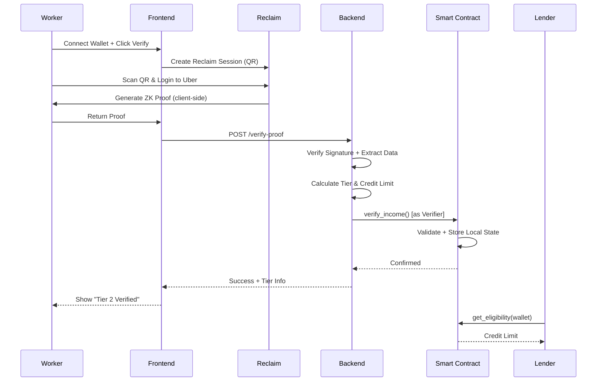
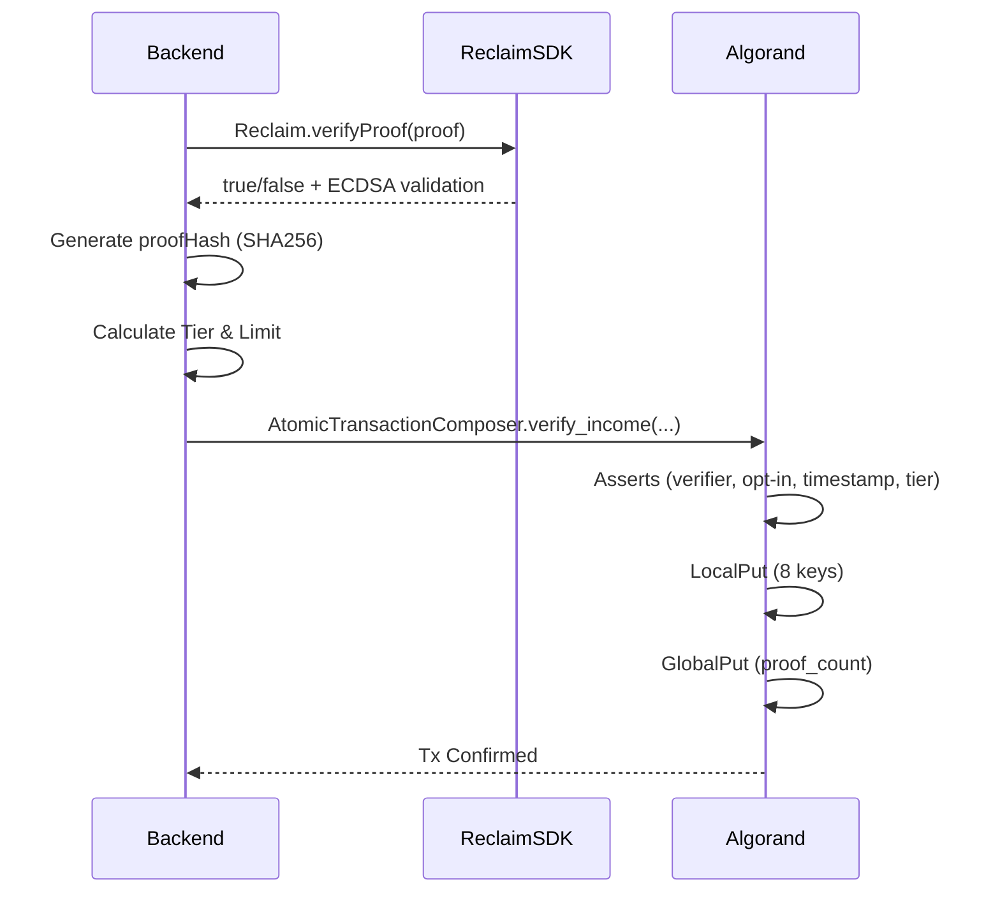
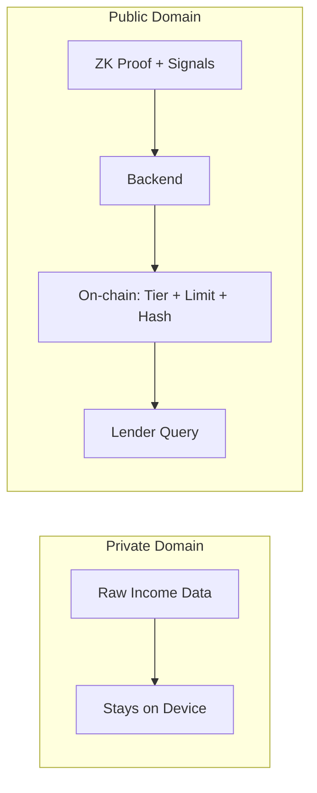
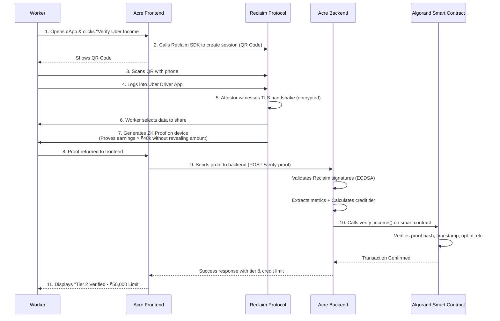
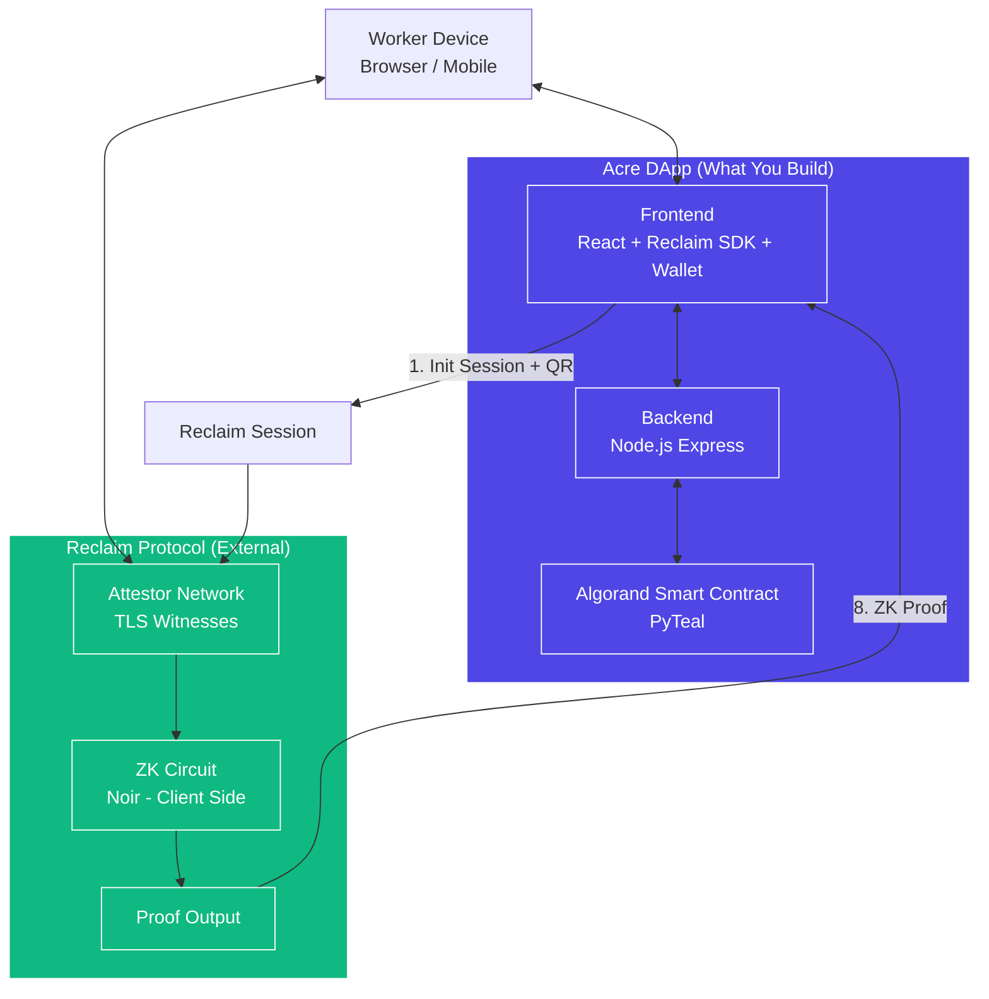
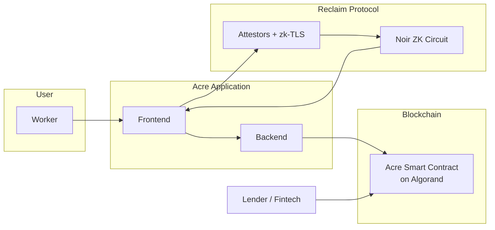

# Acre Protocol — System Architecture

> High-level and detailed architectural documentation for the Acre privacy-preserving income verification protocol.

## Table of Contents

1. [System Overview](#system-overview)
2. [Core Principles](#core-principles)
3. [System Components](#system-components)
4. [High-Level Architecture Diagram](#high-level-architecture-diagram)
5. [Detailed Interaction Flows](#detailed-interaction-flows)
6. [Trust Boundaries](#trust-boundaries)
7. [Off-Chain vs On-Chain Responsibilities](#off-chain-vs-on-chain-responsibilities)
8. [Security Model](#security-model)
9. [Data Flow & Privacy](#data-flow--privacy)

---

## System Overview

**Acre** is a **zero-knowledge income verification protocol** that allows gig workers to prove their earning capacity to lenders **without revealing any raw financial data**.

It bridges Web2 income sources (Uber, banks, Razorpay, etc.) with Web3 (Algorand) using **Reclaim zk-TLS** for attestation and **Noir** for zero-knowledge proofs.

**Core Value Proposition:**  
Privacy + Verifiability + Composability on Algorand.

---

## Core Principles

- **Data Minimization** (DPDP Act compliant)
- **Zero-Knowledge** — Prove predicates, never reveal data
- **On-chain Finality** — Immutable eligibility signals
- **Permissionless Reads** — Any lender can query
- **Minimal On-chain Footprint** — ~70 bytes per user

---

## System Components

| Layer                  | Component                        | Technology                          | Responsibility |
|------------------------|----------------------------------|-------------------------------------|--------------|
| **Client**             | Acre Web App                     | React + Vite + Pera/Defly           | UI, Wallet, Reclaim SDK |
| **Proof Engine**       | Reclaim Protocol                 | zk-TLS + Noir Circuits              | Attestation & ZK Proof Generation |
| **Backend**            | Acre Verifier Service            | Node.js + Express                   | Proof validation, tier calculation, chain submission |
| **Blockchain**         | AcreVerification Contract        | PyTeal (ARC-4) on Algorand          | Immutable state storage & eligibility queries |
| **Lending Layer**      | Fintech SDK / dApps              | TypeScript / Any language           | Read eligibility & issue loans |
| **Monitoring**         | Algorand Indexer + Logs          | Indexer + Event listening           | Audit & notifications |

---

## High-Level Architecture Diagram

```mermaid
flowchart TD
    subgraph Web2 ["Web2 World"]
        A[Income Sources\nUber, Bank AA, Razorpay]
    end

    subgraph ProofLayer ["Proof Layer"]
        B[Reclaim zk-TLS Attestors]
        C[Noir ZK Circuit\nClient-side]
    end

    subgraph Backend ["Acre Backend"]
        D[Express Server]
        E[Tier Calculation Logic]
    end

    subgraph Algorand ["Algorand Blockchain"]
        F[AcreVerification Contract]
        G[Local State per User]
    end

    subgraph Consumer ["Consumers"]
        H[Lenders / Fintechs / DeFi Pools]
    end

    A -->|TLS Session| B
    B -->|Signed Proof| C
    C -->|ZK Proof| D
    D -->|Validate + Tier| E
    E -->|verify_income()| F
    F --> G
    H -->|get_eligibility()| F
```

---

## Detailed Interaction Flows

### 1. High-Level User Journey



### 2. Low-Level Verification Flow



---

## Trust Boundaries

| Boundary                  | Trusted Entities                     | Untrusted / External |
|--------------------------|--------------------------------------|----------------------|
| **User Device**          | Worker’s phone/browser               | - |
| **Reclaim Network**      | Reclaim attestors (Byzantine)        | External income sources |
| **Backend**              | Verifier wallet                      | Backend server (can be compromised) |
| **Blockchain**           | Algorand consensus                   | - |
| **Lenders**              | Any party (permissionless)           | Lenders (can misbehave) |

**Critical Trust Assumptions:**
- Reclaim attestors are honest (decentralized)
- Backend verifier key is secure
- Algorand liveness and security

---

## Off-Chain vs On-Chain Responsibilities

### Off-Chain
- Heavy computation (ZK proof generation)
- Raw data handling (never leaves user device)
- Complex business logic (tier calculation)
- Reclaim integration & signature verification
- User experience (UI/UX, QR scanning)

### On-Chain
- **Immutable eligibility state**
- Authorization enforcement (only verifier can write)
- Freshness & replay protection
- Permissionless queries (`get_eligibility`)
- Audit trail via logs

---

## Security Model

### Threat Model & Mitigations

| Threat                        | Mitigation |
|------------------------------|----------|
| Fake / Tampered Proof         | `Reclaim.verifyProof()` + ECDSA signatures |
| Replay Attack                 | On-chain `proof_hash` uniqueness |
| Backdated Proof               | Timestamp monotonicity check |
| Unauthorized Write            | Verifier-only + Admin/Verifier separation |
| Data Leakage                  | Zero raw data stored anywhere |
| User Impersonation            | Wallet-based + Opt-in requirement |
| Backend Compromise            | Limited to calling `verify_income` only |
| Privacy Breach                | DPDP-compliant data minimization |

### Cryptographic Guarantees

- **zk-TLS** — Server authenticity via Reclaim attestors
- **Noir SNARKs** — Zero-knowledge predicates
- **SHA256** — Proof commitment
- **Algorand** — Deterministic execution + fast finality

---

## Data Flow & Privacy



**Privacy Guarantee:**  
Only `true/false` predicates + tier + credit limit are revealed. Exact income, transactions, and identities remain hidden.

---

**This document serves as the single source of truth for Acre’s architecture.**

---

---

### 1. Step-by-Step User Flow (Sequence Diagram)

```markdown
### Step-by-Step User Flow



**This diagram clearly shows the complete happy path flow.**
```

---

### 2. Architecture — What We Build vs Reclaim

```markdown
### Architecture (What We Build vs Reclaim)



**Legend:**
- **Blue** = What **you build** (Acre)
- **Green** = What **Reclaim provides**

---

### Bonus: Combined High-Level Archit


