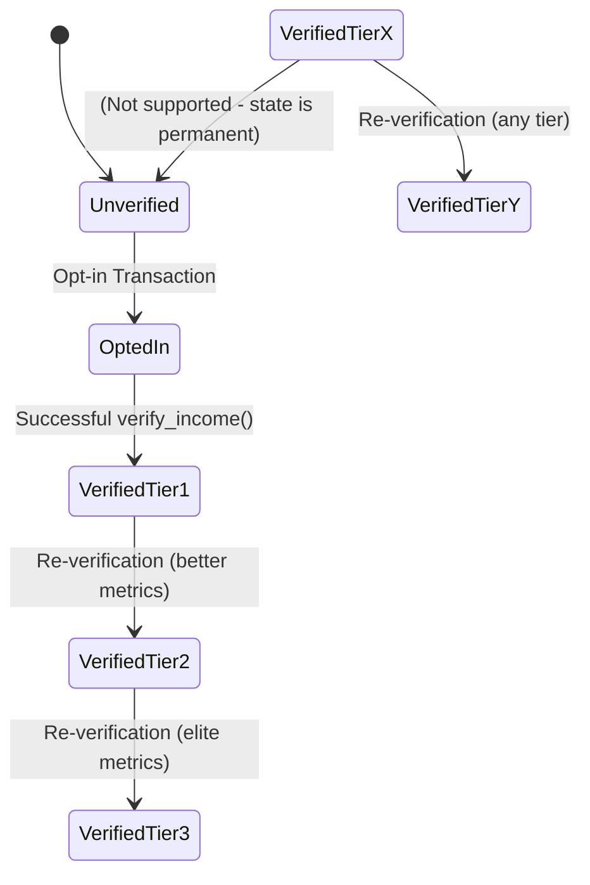

# Acre Protocol — Comprehensive Flows

> Detailed documentation of all user journeys, system interactions, data flows, and error paths in the Acre privacy-preserving income verification protocol.

**Version:** 1.0  
**Date:** April 2026  
**Built for:** AlgoBharat Hack Series 3.0

---

## Table of Contents

1. [Overview](#overview)
2. [Actors & Systems](#actors--systems)
3. [Prerequisites](#prerequisites)
4. [Flow 1: Worker Income Verification (Happy Path)](#flow-1-worker-income-verification-happy-path)
5. [Flow 2: Lender Eligibility Query](#flow-2-lender-eligibility-query)
6. [Flow 3: Wallet Opt-In](#flow-3-wallet-opt-in)
7. [Flow 4: Verifier Rotation (Admin)](#flow-4-verifier-rotation-admin)
8. [Failure Paths & Error Handling](#failure-paths--error-handling)
9. [State Machine & Transitions](#state-machine--transitions)
10. [Timing & Performance](#timing--performance)
11. [Data Flow Summary](#data-flow-summary)

---

## Overview

Acre enables gig workers to prove income eligibility using **Reclaim zk-TLS** + **Algorand smart contracts** while revealing **zero raw financial data**.

**Core Flow (One Line):**

Worker → Reclaim (ZK Proof) → Backend (Verification + Tiering) → Algorand (Immutable State) → Lender (Permissionless Read)

---

## Actors & Systems

| Actor                  | Component                  | Responsibility |
|------------------------|----------------------------|--------------|
| **Gig Worker**         | acre-web (React) + Wallet  | Initiate proof, scan QR, approve |
| **Reclaim Protocol**   | External zk-TLS Service    | Witness TLS, generate ZK proof |
| **Acre Frontend**      | React/Vite + Reclaim SDK   | UI, wallet, Reclaim session |
| **Acre Backend**       | Node.js Express            | Verify proof, calculate tier, submit to chain |
| **Algorand Smart Contract** | PyTeal (ARC-4)        | Store state, enforce rules |
| **Lender / SDK**       | Any dApp / Fintech         | Read eligibility (permissionless) |

---

## Prerequisites

- Worker has Pera or Defly wallet with ≥ 0.1 ALGO
- Worker has access to income source (Uber, bank, etc.)
- Smart contract is deployed and `APP_ID` is known
- Backend is running with valid `VERIFIER_MNEMONIC`
- Frontend configured with Reclaim credentials

---

## Flow 1: Worker Income Verification (Happy Path)

**Total Time:** 5–10 seconds (excluding user scanning)

### Step-by-Step

1. **Connect Wallet**  
   Worker connects Pera/Defly → Frontend stores address.

2. **Initiate Verification**  
   Clicks "Verify Income" → Frontend calls Reclaim SDK → Generates QR code.

3. **Scan & Login**  
   Worker scans QR with phone → Logs into Uber (or other provider) → Reclaim witnesses TLS session.

4. **ZK Proof Generation**  
   Reclaim generates proof on user's device (Noir circuit) → Returns signed proof object.

5. **Submit Proof**  
   Frontend sends proof + `walletAddress` to `POST /verify-proof`.

6. **Backend Verification**  
   - `Reclaim.verifyProof(proof)` → Validates signatures  
   - Extracts ride count, rating, UID  
   - Generates `proofHash = SHA256(JSON.stringify(proof))`

7. **Credit Tier Calculation**  
   Backend computes tier (1/2/3) and credit limit based on metrics.

8. **Submit to Algorand**  
   Backend (as verifier) calls `verify_income()` method with:
   - user_wallet, tier, credit_limit, timestamp, proof_hash, rider_count, rider_rating, platform

9. **Smart Contract Execution**
   - Asserts: caller is verifier, user opted in, tier valid, timestamp fresh
   - Writes local state (~70 bytes)
   - Increments global proof count
   - Emits `VERIFIED|...` log

10. **Confirmation & Response**  
    Backend waits for confirmation → Returns success to frontend.

11. **UI Update**  
    Frontend shows: "✅ Tier 2 Verified — Credit Limit: ₹25,000"

---

## Flow 2: Lender Eligibility Query

**Time:** < 100ms | **Cost:** Free

1. Lender (or SDK) calls:
   - `GET /api/user/:address/eligibility`
   - or directly `get_eligibility(wallet)` via contract

2. Algod returns account local state

3. Response:
   ```json
   {
     "verified": true,
     "tier": 2,
     "creditLimit": 25000,
     "platform": "uber"
   }
   ```

Lender uses this signal to approve/deny loan (their own logic).

---

## Flow 3: Wallet Opt-In

**Required before first verification**

1. Frontend checks if user has opted into contract
2. Shows modal: “Approve Acre Contract Access (~0.1 ALGO)”
3. User signs opt-in transaction
4. Smart contract allows local state storage
5. Frontend enables "Verify Income" button

---

## Flow 4: Verifier Rotation (Admin)

1. Admin calls `POST /api/update-verifier`
2. Backend verifies caller is admin
3. Calls `update_verifier(newVerifier)` on contract
4. Global state `GS_VERIFIER` is updated

---

## Failure Paths & Error Handling

| Error | Location | Response | Recovery |
|------|--------|--------|--------|
| Invalid Proof Signature | Backend | 400 + message | Re-generate proof |
| User Not Opted In | Smart Contract | 409 + `needsOptIn: true` | Trigger opt-in flow |
| Timestamp Not Fresh | Smart Contract | Tx rejected | Use newer proof |
| Invalid Tier | Smart Contract | Tx rejected | Fix backend logic |
| Insufficient Funds (User) | Opt-in / Tx | Tx failed | Add ALGO |
| Reclaim Session Expired | Reclaim | QR fails | Generate new QR |
| Network / RPC Failure | Any | Timeout / Error | Retry |
| Wallet Not Connected | Frontend | Button disabled | Connect wallet |

---

## State Machine & Transitions



**Key Invariants:**
- `verified == 1` ⇔ `proof_hash` exists
- `tier` always ∈ {1, 2, 3}
- Timestamp **never decreases**
- Only designated verifier can write

---

## Timing & Performance

| Operation                     | Typical Time     | Bottleneck      |
|------------------------------|------------------|-----------------|
| Reclaim QR + Login           | 20–60 seconds    | User action     |
| Proof Generation             | < 2 seconds      | Client device   |
| Backend Processing           | ~300 ms          | -               |
| Algorand Transaction Finality| ~4 seconds       | Consensus       |
| Lender Query                 | < 100 ms         | RPC read        |
| **End-to-End (Happy Path)**  | **5–10 seconds** | -               |

---

## Data Flow Summary

```mermaid
flowchart TD
    A[Worker Device] --> B[Reclaim zk-TLS]
    B --> C[ZK Proof ~5-10KB]
    C --> D[Frontend]
    D --> E[Backend /verify-proof]
    E --> F[Verify + Tier Calc]
    F --> G[proofHash + Tier Data]
    G --> H[Algorand verify_income()]
    H --> I[Local State ~70 bytes]
    I --> J[Lender Query]
    J --> K[Credit Decision]
```

**Compression:** 5–10 KB proof → 70 bytes on-chain (71:1 reduction)

---

## Key Takeaways

- **Privacy First**: Raw data never leaves worker’s device
- **On-Chain Trust**: Immutable eligibility signal
- **Permissionless Reads**: Any lender can query
- **Atomic & Auditable**: All writes are verifiable
- **Recoverable**: Clear error paths with user-friendly recovery

---


*This document is the single source of truth for all Acre protocol flows.*
